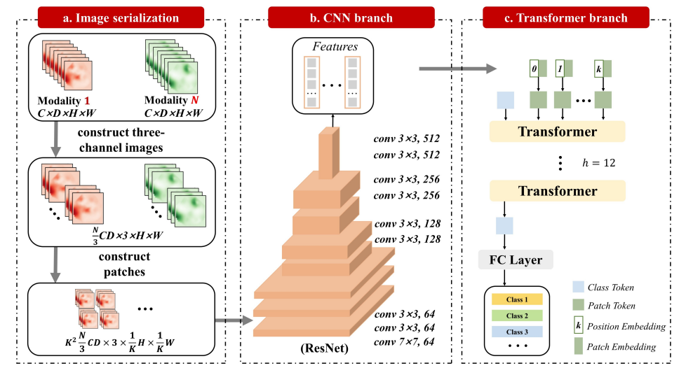

# PyTorch Implementation of # TransMed (for pilot study in paper "Multihead Neural Network for Multiple Segmented Images-based Diagnosis of Thyroid-associated Orbitopathy Activity.")
 
The preprocessing and architecture can be referenced by a manuscript entitled, "TransMed: Transformers Advance Multi-Modal Medical Image Classification." 

## Overview
This repository contains an unofficial implementation of TransMed using PyTorch.<br/>


## Neural Network Block

## Paper
If you use this software for your research, please cite:

```bibtex
@article{dai2021transmed,
  title={Transmed: Transformers advance multi-modal medical image classification},
  author={Dai, Yin and Gao, Yifan and Liu, Fayu},
  journal={Diagnostics},
  volume={11},
  number={8},
  pages={1384},
  year={2021},
  publisher={MDPI}
}
```

## License
This program is available for download for non-commercial use, licensed under the GNU General Public License. This allows its use for research purposes or other free software projects but does not allow its incorporation into any type of commercial software.

## Files
The repository contains the following files:
- `TransMed.py`: Python script file, containing the PyTorch implementation of the TransMed
- `TransMed.png`: Figure file for network
- `README.md`: Markdown file explaining the model source code
